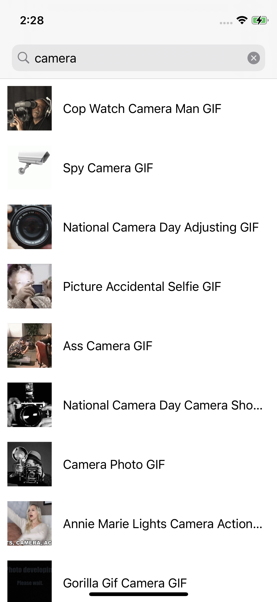

# Dispo iOS Take Home

Create an iOS app with two views, `MainViewController` and `DetailViewController`. The `MainViewController` contains a list of GIFs from the [Tenor API](https://tenor.com/gifapi/documentation).

When there is no query, the view should display the featured gifs. When there is a query, it should display the search results from the API.

Tapping on a cell should push the `DetailViewController`. When the `DetailViewController` loads, it should request more information from the API like share count, tags, and background color, and display it. This data must be requested from `DetailViewController`, not passed from the previous view controller.

As much as possible, stick to the Combine ViewModel structure implemented in the `MainViewController`. The `DetailViewController` should use a similar system for loading additional information from the API.

You cannot use any additional dependencies.

## Setup

Get an API key [here](https://tenor.com/developer/keyregistration) and put it into `Constants.swift`

## Evaluation

### What you will be evaluated on

- Functionality - can you translate the requirements into working code
- Following modern best practices
- Usage of Combine
- Usage of SnapKit for laying out views

### What you will not be evaluated on

- Testing
- Styling of views outside of functionality

## Submission Instructions

Create a private GitHub repository and invite `malonehedges` and `regynald` and respond to the email sent from `m@dispo.fun` when ready.

